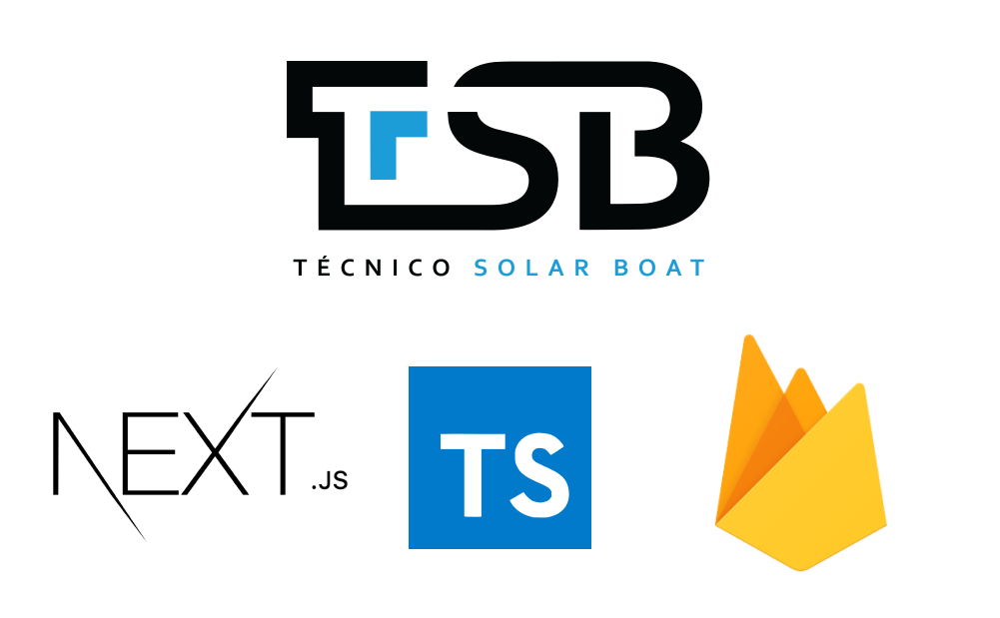

<!-- PROJECT SHIELDS -->
<!--
*** I'm using markdown "reference style" links for readability.
*** Reference links are enclosed in brackets [ ] instead of parentheses ( ).
*** See the bottom of this document for the declaration of the reference variables
*** for contributors-url, forks-url, etc. This is an optional, concise syntax you may use.
*** https://www.markdownguide.org/basic-syntax/#reference-style-links
-->

[![Contributors][contributors-shield]][contributors-url]
[![Forks][forks-shield]][forks-url]
[![Stargazers][stars-shield]][stars-url]
[![Issues][issues-shield]][issues-url]
[![MIT License][license-shield]][license-url]
[![LinkedIn][linkedin-shield]][linkedin-url]

<!-- PROJECT LOGO -->
<br />
<p align="center">
  <a href="https://github.com/dinis-rodrigues/tsb-web-official">
    
  </a>

  <h3 align="center">TSB Official Website</h3>

  <p align="center">
    Técnico Solar Boat official website open-sourced, built with NextJS, Typescript and Firebase
    <br />
    <a href="https://github.com/dinis-rodrigues/tsb-web-official" target="_blank"><strong>Explore the docs »</strong></a>
    <br />
    <br />
    <a href="https://tecnicosolarboat.tecnico.ulisboa.pt/" target="_blank">View Website</a>
    ·
    <a href="https://github.com/dinis-rodrigues/tsb-web-official/issues" target="_blank">Report Bug</a>
    ·
    <a href="https://github.com/dinis-rodrigues/tsb-web-official/issues" target="_blank">Request Feature</a>
  </p>
</p>

<!-- TABLE OF CONTENTS -->
<details open="open">
  <summary>Table of Contents</summary>
  <ol>
    <li>
      <a href="#about-the-project">About The Project</a>
      <ul>
        <li><a href="#built-with">Built With</a></li>
      </ul>
    </li>
    <li>
      <a href="#getting-started">Getting Started</a>
      <ul>
        <li><a href="#prerequisites">Prerequisites</a></li>
        <li><a href="#firebase-setup">Firebase Setup</a></li>
        <li><a href="#environment-variables-setup">Environment Variables Setup</a></li>
        <li><a href="#php-setup">PHP Setup</a></li>
      </ul>
    </li>
    <li><a href="#deploy">Deploy</a></li>
    <li><a href="#roadmap">Roadmap</a></li>
    <li><a href="#contributing">Contributing Guidelines</a></li>
    <li><a href="#license">License</a></li>
    <li><a href="#contact">Contact</a></li>
  </ol>
</details>

<!-- ABOUT THE PROJECT -->

## About The Project

<!-- [![Product Name Screen Shot][product-screenshot]](https://example.com) -->

### Features

- Full Page Scroll
- Contact Form
- Machine Learning Interactive Example
- Individual Team Member Profiles
- Gallery
- Open Source Page
- Recruitment Page

### Built With

Front-end of the application was developed with:

- [TypeScript](https://www.typescriptlang.org)
- [NextJS](https://nextjs.org/)

Back-end of the application was developed with:

- [Firebase](https://firebase.google.com)
- [PHP](https://www.php.net/)

<!-- GETTING STARTED -->

## Getting Started

This project follows the `create-next-app` file structure. If you would like to set up this project up and running locally for yourself, follow these steps.

### Prerequisites

Clone the repository

```sh
git clone https://github.com/dinis-rodrigues/tsb-web-official.git
```

Install all project dependencies

```sh
npm install
```

### Firebase Setup

This website is tightly integrated with our own project management application, which is
open-sourced as well, but we provide a public setup example to get you going.

To setup your own database, it only takes 2 min.

1. Create a Firebase Project [here](https://firebase.google.com) with a name `your-application`
2. Setup **Realtime Database** (not Firestore)
3. Import the database template from

```sh
components/utils/dbTemplate.json
```

5. Import the database rules from

```sh
components/utils/dbRules.json
```

6. Repeat the above steps to create a development database
   In development you should use a copy of the original database. In the case something goes
   wrong, your original DB remains intact. So just repeat these steps for the development
   database and give it a project name, for example, `your-application-dev`.

### Environment Variables Setup

To protect sensitive information on firebase API keys we take advantage of environment
variables, which remain private for developers, while maintaining a public repository.
These variables are stored in a `.env` file in the root of the repository. You can check
the template used in `template.env` and replace all of the variables with your own.
Don't forget to rename the file to only `.env` 😀

If you aren't using a development database, or a firebase token leave those fields empty
or remove them, as they are optional for the next step.

**Optional**

Now let's automate things! The project is already setup to always use the development database while
in development, and to use the original database when building for production (check `components/Contexts/Firebase.tsx`). But we
also want the development database to always be up to date with the original one, in
order to work with real data.

For this we take advantage of the [Firebase
CLI](https://firebase.google.com/docs/cli/#cli-ci-systems) to export the data from
the original database (`your-application`) and export it to the development database (`your-application-dev`)

Install `Firebase CLI` in your system:

```sh
npm install -g firebase-tools
```

**You only have to do this once**. Retrieve and copy the firebase CLI token from the terminal and add it to the `.env`
variable placeholder:

```sh
firebase login:ci
```

**You only have to do this once**. Setup the connection to the databases using the provided script, and follow the on-screen
instructions:

```sh
sh firebase_databases_setup.sh
```

Last step! Sync your original database with your development one by running our syncing
script. This will copy all of the data from the original to the development database:

```sh
sh firebase_databases_sync.sh
```

Since we previously configured the databases, you can now sync the databases whenever
you want, without configuring them again.

### PHP Setup

All of our API's are located in `public/api`.

There is one folder `protected` which we place at the root location, which contains
protected keys and values for our php api. We provide a template for it, if you need it.

In order to work with the PHP api you need to locally run a php server / have a
production ready server.

## Deploy

If you followed all of the above steps, you can proceed to locally run the
project with

```sh
npm run dev
```

If you would like to deploy the application to your own server, run

```sh
npm run build
```

This will create a `out` folder. Just copy all of the contents of the folder
to the root directory of your server.

<!-- ROADMAP -->

## Roadmap

See the [open
issues](https://github.com/dinis-rodrigues/tsb-web-official/issues) for a list
of proposed features (and known issues), if any.

<!-- CONTRIBUTING -->

## Contributing

Contributions are what make the open source community such an amazing place to learn,
inspire, and create. Any contributions you make are **greatly appreciated**. To ensure a
good workflow for this repository please follow our contributing guidelines:

- [Contributing Guidelines](.github/docs/CONTRIBUTING.md)

<!-- LICENSE -->

## License

Distributed under the MIT License. See `LICENSE` for more information.

<!-- CONTACT -->

## Contact

Dinis Rodrigues - [Linkedin](https://www.linkedin.com/in/dinis-rodrigues/) - dinis.rodrigues@tecnico.ulisboa.pt

<!-- MARKDOWN LINKS & IMAGES -->
<!-- https://www.markdownguide.org/basic-syntax/#reference-style-links -->

[contributors-shield]: https://img.shields.io/github/contributors/dinis-rodrigues/tsb-web-official.svg?style=for-the-badge
[contributors-url]: https://github.com/dinis-rodrigues/tsb-web-official/graphs/contributors
[forks-shield]: https://img.shields.io/github/forks/dinis-rodrigues/tsb-web-official.svg?style=for-the-badge
[forks-url]: https://github.com/dinis-rodrigues/tsb-web-official/network/members
[stars-shield]: https://img.shields.io/github/stars/dinis-rodrigues/tsb-web-official.svg?style=for-the-badge
[stars-url]: https://github.com/dinis-rodrigues/tsb-web-official/stargazers
[issues-shield]: https://img.shields.io/github/issues/dinis-rodrigues/tsb-web-official.svg?style=for-the-badge
[issues-url]: https://github.com/dinis-rodrigues/tsb-web-official/issues
[license-shield]: https://img.shields.io/github/license/dinis-rodrigues/tsb-web-official?style=for-the-badge
[license-url]: https://github.com/dinis-rodrigues/tsb-web-official/blob/main/LICENSE
[linkedin-shield]: https://img.shields.io/badge/-LinkedIn-black.svg?style=for-the-badge&logo=linkedin&colorB=555
[linkedin-url]: https://linkedin.com/in/dinis-rodrigues
[product-screenshot]: public/assets/images/readMeImages/appScreen.png
